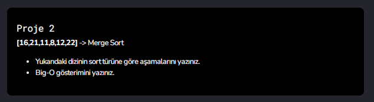

# 
## 1)
1=>  [16,21,11]       [8,12,22]

2=> [16,21] [11]     [8,12] [22]

3=> [16] [21] [11] [8] [12] [22]

4=> [16,21] [8,11] [12,22]

5=> [8,11,16,21] [12,22]

6=> [8,11,12,16,21,22]

## 2) 

=> O(nlogn)